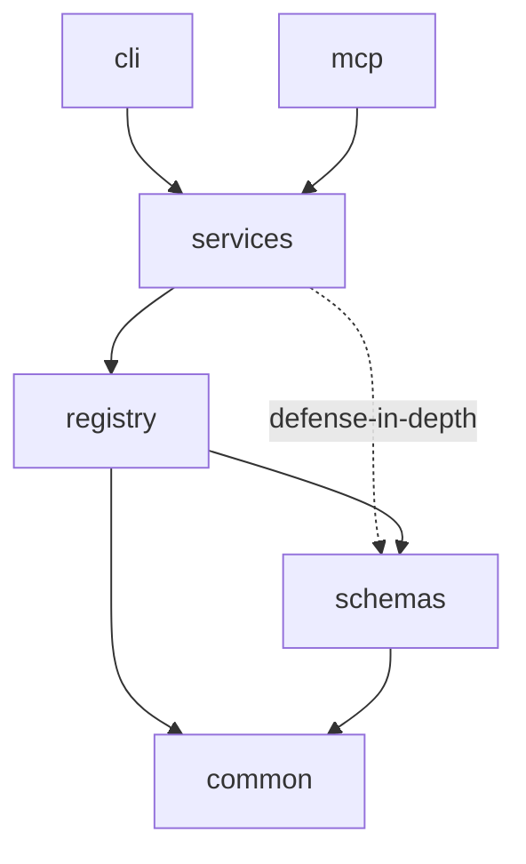

# Proposal: Schema & Crate Architecture

> Status: Draft — schema is a concrete reference copy, not yet loaded by any runtime (see `schema/README.md`); crate boundaries are structural design only, no implementation code. Conforms to `docs/raw/architecture.md` standard, including its optional Crate Architecture / Trait Design sections. Per-crate documentation follows the `docs/raw/crates.md` standard and lives under `docs/raw/crates/`.
> **Revised:** schema is now grouped by physical database (`mcp.db`, `repo.db`) — two files total — not by five concern-folders. See "Why two databases, not five" in `schema/README.md`.
> **Gates implementation.** This document, and the reference schema under `schema/`, must be reviewed and fixed before any of 01-07 are implemented. A wrong table shape is cheap to fix now and expensive to fix once repositories, Domain Systems, and Task Instances have real data in it.

## Purpose

This document defines the standard for how the entities specified in proposals 01-07 (Agent, Skill, Epic/Usecase/Task, Agent System, Domain System, MCP Registration, Proposal & Execution) are realized as concrete storage and as a Rust crate workspace, before implementation begins.

Unlike proposals 01-07, which describe structure without naming storage or a runtime, this document names both — a SQLite schema (mirroring Samgraha's `schema/` reference-copy convention) and a Cargo workspace crate split (mirroring Samgraha's `crates/` layout) — because Dharma is the same category of system Samgraha already is: a Rust MCP server backed by SQLite. Reusing a working shape is not a compromise on Non-Goals; Architecture Documentation may reference prior art's structural decisions when justifying its own.

## System Overview

### Overview

Two physical SQLite databases replace the single `standard`-scoped `knowledge.db` Samgraha uses: `mcp.db` (one, global — lives in MCP's own data directory, never inside a repository; holds the Domain System and Agent System registries plus all their content, and the repository-registration/Capability-Manifest state) and `repo.db` (one per registered repository, living inside that repository; holds the Propose→Review→Approve→Execute runtime state for that repo's Task Instances). A six-crate Rust workspace — `common`, `schemas`, `registry`, `services`, `cli`, `mcp` — implements and serves them, in the same dependency shape Samgraha already validated in production.

### Structural Approach

The two databases map onto exactly one distinction proposals 01-07 already draw: platform-owned, Agent-Management-authored content (Domain Systems, Agent Systems, and everything they define) versus repository-owned runtime state (Task Instances and their Propose/Execute history). No new entity is introduced here. Crates map onto layers of responsibility (primitives → validation/storage → business logic → entry points), not onto database boundaries — a single crate (`registry`) owns both databases' migrations and access, because they share one storage technology and one migration discipline; only `repo.db` → `mcp.db` is a cross-database reference, everything inside `mcp.db` is a real foreign key (see `schema/README.md`, "Why two databases, not five").

### Diagram

```text
┌───────────────────────────────┐        ┌───────────────────────────────┐
│   mcp.db (one, global)         │        │  repo.db (one per repository)  │
│   registries + their content   │◀──────▶│  Task Instance runtime state   │
│   + repo_registration          │ logical │  (task_id, agent refs are      │
│                                │ ref only│   logical refs into mcp.db)    │
└───────────────────────────────┘        └───────────────────────────────┘
                              ▲
                              │ migrated & queried by
┌─────────────────────────────────────────────────────────────────┐
│         registry crate  ──validates via──▶  schemas crate         │
└─────────────────────────────────────────────────────────────────┘
                              ▲
                              │ used by
┌─────────────────────────────────────────────────────────────────┐
│                          services crate                           │
└─────────────────────────────────────────────────────────────────┘
                    ▲                           ▲
                    │                           │
              cli crate                   mcp crate
```

## Component Model

### `common` crate
- **Responsibility:** Zero-dependency primitives — error types, environment/config resolution, filesystem helpers, ID generation, shared traits.
- **Ownership:** No schema area; owns cross-cutting types every other crate depends on.
- **Interfaces:** Depended on by every other crate; depends on nothing internal.

### `schemas` crate
- **Responsibility:** JSON Schema definitions and validation for every JSON-shaped column in `schema/` — Task Input/Output Contracts, Acceptance Criteria, Skill Invocation Contracts, proposal drafts, Context Envelope payloads.
- **Ownership:** JSON Schema documents and the validation entry point; not the SQLite migrations themselves.
- **Interfaces:** Depended on by `registry` (the enforcement boundary — every write is validated here before commit, regardless of caller) and, as defense-in-depth only, by `services` (early feedback before a call even reaches `registry`; not itself a security boundary).

### `registry` crate
- **Responsibility:** Owns SQLite migrations and typed access for both physical databases (`mcp.db`, `repo.db`).
- **Ownership:** The `.sql` migration constants (mirrored from `schema/`, the canonical reference copy — see `schema/README.md`), and the `repo.db` → `mcp.db` logical-reference validation named in `schema/`'s comments — the only cross-database boundary in this schema; every reference within `mcp.db` itself is a real `FOREIGN KEY`, needing no validation at this layer beyond what SQLite already enforces.
- **Interfaces:** Depends on `common` and `schemas`; exposes typed read/write functions per table, never raw SQL, to `services`. See [`docs/raw/crates/registry.md`](../raw/crates/registry.md) for this crate's own Crate document.

### `services` crate
- **Responsibility:** Business logic implementing proposals 01-07's behavior — repository registration, Domain/Agent System resolution (Default/Bootstrap Agent System logic), Proposal Loop drafting/revision, Handoff Broker resolution, Completion Validator checks.
- **Ownership:** No schema directly; orchestrates `registry` calls to implement each proposal's Component Model.
- **Interfaces:** Depends on `registry`, `schemas`, `common`; exposes the operations both `cli` and `mcp` call.

### `cli` crate
- **Responsibility:** Command-line entry point for administrative operations — registering a Domain System or Agent System, inspecting registries, running migrations.
- **Ownership:** No schema; a thin argument-parsing layer over `services`.
- **Interfaces:** Depends on `services`; the only crate with a `main` used for administration.

### `mcp` crate
- **Responsibility:** MCP protocol server exposing Dharma's operations as tools — repository registration, Task assignment, proposal submission/approval, handoff.
- **Ownership:** No schema; the protocol adapter over `services`.
- **Interfaces:** Depends on `services`; the only crate with a `main` used at runtime by MCP clients.

### Component Diagram

```text
cli, mcp ──depend on──▶ services ──depend on──▶ registry ──depend on──▶ schemas ──depend on──▶ common
                              │                                                        ▲
                              └───────────depend on (defense-in-depth only)────────────┘
```

## Crate Architecture

This system is organized as a Cargo workspace with six crates enforcing the same architectural boundaries Samgraha already validated: primitives (`common`), validation (`schemas`), storage (`registry`), business logic (`services`), and two entry points (`cli`, `mcp`) that share `services` rather than duplicating logic. This section is the whole-workspace crate graph; one Crate document per member (following the `docs/raw/crates.md` standard) lives under `docs/raw/crates/` — [`common`](../raw/crates/common.md), [`schemas`](../raw/crates/schemas.md), [`registry`](../raw/crates/registry.md), [`services`](../raw/crates/services.md), [`cli`](../raw/crates/cli.md), [`mcp`](../raw/crates/mcp.md).



### Dependency Direction

`common` has zero internal dependencies. `schemas` depends only on `common`. `registry` depends on `common` and `schemas` — `registry` is the single enforcement point where every write is validated against `schemas` before commit, per the Threat Model's cross-database-reference-forgery mitigation. `services` depends on `registry`, `common`, and (defense-in-depth only, not an enforcement boundary) `schemas`, and on nothing else internal. `cli` and `mcp` depend only on `services` (transitively on everything below) — neither may depend on the other, and neither may call `registry` directly, bypassing `services`.

## Trait Design

The system relies on trait-based abstraction to decouple `services` from the storage mechanism, so `registry`'s SQLite-backed implementation can be swapped in tests or future storage changes without touching business logic.

Each schema file's tables are covered by one or more traits in `registry`, named for exactly what they cover so a trait name never has to be double-checked against which physical db it touches. Within `mcp.db`: `DomainSystemRegistryStore` (`domain_system_registry`), `DomainContentStore` (`section`/`section_profile`/`epic`/`usecase`/`task`/`task_step`, scoped by `domain_system_id`), `AgentSystemRegistryStore` (`agent_system_registry`), `AgentContentStore` (`agent`/`agent_goal`/`skill`/`skill_prompt`/`skill_script`/`skill_example`/`agent_skill_binding`, scoped by `agent_system_id`), and `RegistrationStore` (`repo_registration`/`capability_manifest`). Within `repo.db`: `ExecutionStore` covers all seven tables. `services` depends on these generically, never on a concrete SQLite type.

### Generic Constraints

`services`' orchestration functions (e.g. the Default/Bootstrap Agent System's resolution logic, the Handoff Broker's routing) are generic over the relevant store traits, so a test can inject an in-memory fake store without spinning up SQLite, and the production binary injects the real `registry` implementation at startup.

## Communication

### Communication Paths

**`services` → `registry`**
- **Pattern:** Synchronous function calls, no network hop (in-process).
- **Contract:** `services` calls typed `registry` functions per table; `registry` returns typed rows or a logical-reference validation error.

**`cli` / `mcp` → `services`**
- **Pattern:** Synchronous function calls (`cli`) or async request/response (`mcp`, per the MCP protocol).
- **Contract:** Both entry points call the same `services` functions; neither re-implements business logic, so behavior cannot drift between the two entry points.

### Communication Diagram

```text
mcp/cli → services : registerRepo(name, domainSystemName)
services → registry : DomainSystemRegistryStore::lookup(name)
services → registry : RepoRegistrationStore::insert(pending)
services → registry : validate cross-db logical reference
registry → services : typed result | logical-reference error
```

## Data Flow

### Data Paths

**`mcp.db` Write Path**
- **Entry point:** A `services` function call touching a registry, Domain/Agent System content, or registration table (e.g. approving a Capability Manifest entry).
- **Transformations:** `schemas` validates the JSON-shaped payload; `registry` writes the row. Every reference this write makes to another `mcp.db` table is a real `FOREIGN KEY`, checked by SQLite itself — there is no separate cross-database validation step, because everything referenced lives in the same file.
- **Ownership boundary:** `registry` is the only crate that opens a SQLite connection; `services` never does.
- **Exit point:** A committed row, or an FK-violation/validation error surfaced back through `services`.

**`repo.db` Write Path**
- **Entry point:** A `services` function call touching Task Instance runtime state (e.g. recording a handoff).
- **Transformations:** `schemas` validates the JSON-shaped payload; `registry` writes the row. Where the write includes a logical reference into `mcp.db` (e.g. `task_instance.task_id`, or an `agent_system_id`/`agent_id` pair), `registry` validates that reference against `mcp.db` before committing — the one cross-database check in this schema.
- **Ownership boundary:** `registry` is the only crate that opens either SQLite connection; `services` never does.
- **Exit point:** A committed row, or a validation error (FK violation within `repo.db`, or logical-reference error against `mcp.db`) surfaced back through `services`.

### Data Flow Diagram

```text
services ──payload──▶ schemas (validate JSON) ──▶ registry ──┬──▶ mcp.db   (FK-checked internally)
                                                              └──▶ repo.db  (FK-checked internally;
                                                                             logical ref into mcp.db
                                                                             validated by registry)
```

### Data Ownership

| Data Entity | Owning Component |
|---|---|
| `mcp.db` (registries, Domain/Agent System content, `repo_registration`, `capability_manifest`) | `registry` crate, written only via Agent-Management Agent System calls (registries/content) or the MCP registration flow (`repo_registration`/`capability_manifest`) through `services` |
| `repo.db` (per repository) | `registry` crate, written by Proposal & Execution Protocol calls through `services` |
| JSON Schema documents | `schemas` crate |

## Security

### Trust Boundaries

- **`mcp`/`cli` → `services`:** Both entry points are equally trusted internally, but `mcp` additionally sits at the boundary to external MCP clients — its inputs are untrusted until `services`/`schemas` validate them.
- **`services` → `registry`:** Trusted, in-process boundary; `registry` is the only component with filesystem/SQLite access.

### Threat Model

- **Bypassing `services`:** A future crate calls `registry` directly, skipping validation or the Agent-Management authorization check. Mitigation: `registry`'s store traits are not re-exported as part of `cli`'s or `mcp`'s public surface; only `services` depends on `registry`.
- **Cross-database reference forgery:** A `repo.db` write supplies a `task_id`, `agent_system_id`, or `agent_id` that does not exist in `mcp.db` — the only place this class of bug can occur, since every reference within `mcp.db` itself is a real `FOREIGN KEY` SQLite enforces on its own. Mitigation: `registry` validates this one remaining logical reference (see `schema/README.md`) before committing the referencing row in `repo.db`, in the same transaction-adjacent step.
- **Schema drift between `schema/` and the Rust migrations:** The `.sql` reference copy and the `registry` crate's actual migration constants diverge over time. Mitigation: `schema/` is the canonical reference (mirroring Samgraha's convention); a code-review gate should diff `registry`'s migration constants against `schema/` on every change to either.

## Rationale

### Two Physical Databases, Grouped by Where They Live — Not Five Concern-Folders
- **Context:** An earlier draft of this schema split storage into five concern-folders (`platform`, `domain`, `agent`, `registration`, `execution`), with `domain` and `agent` further split one-file-per-registered-entry. Samgraha, by contrast, groups by where data physically lives: global (`standards.db`, `registry.db`, in `mcp_dir()`) versus per-repository (`knowledge.db`, inside each repo).
- **Decision:** Group by physical database instead: `mcp.db` (one, global — every registry and its content, plus repository registration) and `repo.db` (one per registered repository — that repo's Task Instance runtime state).
- **Alternatives Considered:** Keep the five concern-folders, including one db file per registered Domain System / Agent System.
- **Rejection Reason:** The five-folder split put every reference between a registry and its own content (`domain_system_registry` → `section`/`epic`/`usecase`/`task`, `agent_system_registry` → `agent`/`skill`) across separate files, turning what is genuinely one platform-owned, Agent-Management-authored dataset into unenforced cross-database logical references — for no isolation benefit, since none of that content is repository-owned or physically separated for a real operational reason. Grouping by physical database instead means content sharing a file gets a real `FOREIGN KEY`, and only the one boundary that is genuinely separate data (`repo.db` ↔ `mcp.db`) keeps the logical-reference treatment.
- **Architectural Goal:** Storage boundaries mirror actual data-locality boundaries (global platform state vs. per-repository runtime state), not an arbitrary concern taxonomy layered on top of one physical location.

### Domain/Agent System Content Shares `mcp.db`, Scoped by a Real Foreign Key
- **Context:** Both Domain Systems and Agent Systems are named, versioned, independently-authored assets that repositories select rather than author (proposals 04/05); their content (Section Map/Epic-Usecase-Task set, Agent/Skill set respectively) is exactly as global and platform-owned as the registry entry naming them.
- **Decision:** All Domain Systems' content shares `mcp.db`'s `section`/`epic`/`usecase`/`task`/`task_step` tables, scoped by a real `domain_system_id` FOREIGN KEY; all Agent Systems' content shares `agent`/`skill`/... scoped by `agent_system_id`.
- **Alternatives Considered:** One `.db` file per registered Domain System / Agent System (the earlier design).
- **Rejection Reason:** A separate file per registered entry turned every reference from that content back to its own registry row into an unenforced logical reference, and gained no isolation benefit — nothing about a Domain System's content needs a separate physical file the way `repo.db` genuinely does (different machine, different lifecycle, potentially different backup/access policy).
- **Architectural Goal:** Reserve the logical-reference/separate-file treatment for boundaries that are actually separate data, per the previous Rationale entry.

### Reuse Samgraha's Six-Crate Split
- **Context:** Samgraha already validated a `common → {schemas, registry} → services → {cli, mcp}` dependency shape in a production Rust MCP server of the same category Dharma is building.
- **Decision:** Reuse the same crate names and dependency direction rather than designing a new split.
- **Alternatives Considered:** A different crate boundary, e.g. one crate per physical database (`mcp` crate, `repo` crate).
- **Rejection Reason:** A per-database crate split would fragment `registry`'s migration discipline across two crates for no isolation benefit, since `mcp.db` and `repo.db` share one storage technology and one validation crate.
- **Architectural Goal:** Reuse over reinvention (same principle applied in proposal 05 for Bodha's Section Map format).

## Constraints

### Hard Constraints
- **`registry` is the only crate with SQLite access** (source: Trust Boundaries above) — `cli` and `mcp` may not depend on `registry` directly.
- **`schema/` is the canonical reference copy** (source: `schema/README.md`) — the `registry` crate's actual migrations must match it; divergence is a defect, not an acceptable variance.
- **The `repo.db` → `mcp.db` logical reference is validated by `registry` before commit** (source: Threat Model above) — no `repo.db` write may reference an `mcp.db` row (`task`, `agent_system_registry`, `agent`) that doesn't exist. No other cross-database reference exists in this schema; every reference within `mcp.db` is a real `FOREIGN KEY`.

### Soft Constraints
- Prefer extending an existing table over adding a new one when a proposal 01-07 revision only adds a field, to keep the schema-to-proposal mapping obvious.

## Traceability

### Derivation Chain

```text
01-agent-model, 02-task-model, 03-skill-model, 04-agent-system-registry,
05-domain-system-registration, 06-mcp-registration-bootstrap,
07-proposal-execution-protocol
    │
    ▼
Schema & Crate Architecture (this document) + schema/ (reference SQL:
mcp.db, repo.db) + docs/raw/crates.md (per-crate doc standard) +
docs/raw/crates/ (one Crate document per member: common, schemas,
registry, services, cli, mcp)
    │
    ▼
(implementation gate — schema/ must be reviewed and fixed here, before
 01-07 are implemented against it)
```

### Non-Contradiction Rule

No implementation may write to a table shape that differs from `schema/`'s reference copy without first revising both this document and `schema/`. No crate other than `registry` may open a SQLite connection, without revising this document first. No schema change may reintroduce a logical reference for content that lives inside `mcp.db` — that content shares one file specifically so those references can be real `FOREIGN KEY`s (see Rationale above); only the `repo.db` → `mcp.db` boundary may use the logical-reference pattern.
