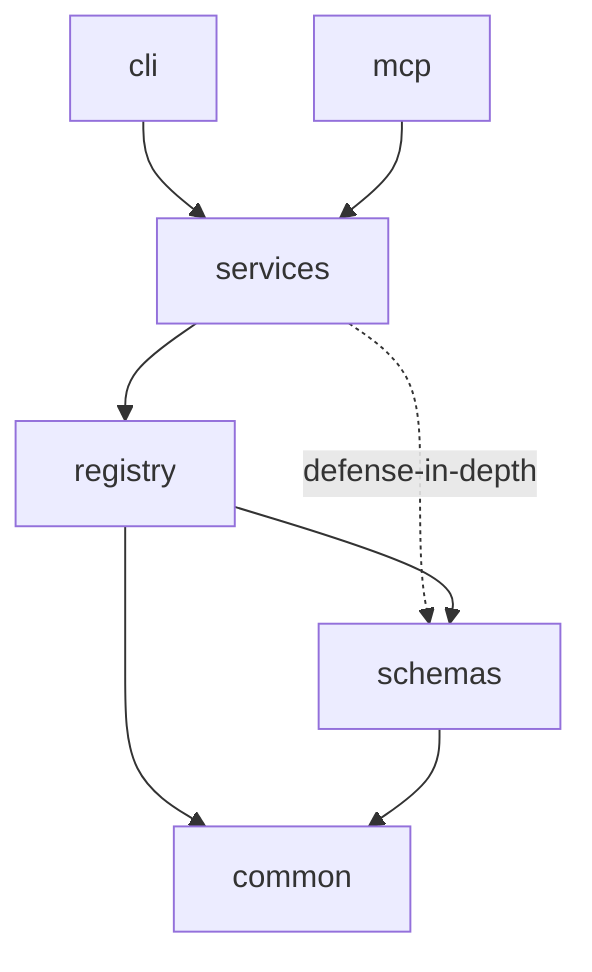

# Proposal: Schema & Crate Architecture

> Status: Draft — schema is a concrete reference copy, not yet loaded by any runtime (see `schema/README.md`); crate boundaries are structural design only, no implementation code. Conforms to `docs/raw/architecture.md` standard, including its optional Crate Architecture / Trait Design sections. Per-crate documentation follows the `docs/raw/crates.md` standard and lives under `docs/raw/crates/`.
> **Revised:** the schema now models Dharma as pure MCP *infrastructure* — it registers, captures, and serves Domain Systems and Agent Systems supplied by external providers, it does not author them. Adds the capture ledger, Domain content model (domains, Section Maps, Section Profiles, YAML round-trip templates, seeders), the Skill asset model (prompt/script/example/template), and the audit subsystem (deterministic + per-model semantic, override/cancel, evidence, weights, report templates). See "Role of Dharma" below.
> **Gates implementation.** This document, and the reference schema under `schema/`, must be reviewed and fixed before any of 01-07 are implemented. A wrong table shape is cheap to fix now and expensive to fix once repositories, Domain Systems, and Task Instances have real data in it.
> **See also Provider Config & Repo Sync (11):** the `dharma-domain.toml`/`dharma-agent.toml`/`dharma-repo.toml`/`dharma-build.toml` config surface, and the full-domain/filtered-agent sync semantics for `synced_content` (repo/07) this document's schema already carries.

## Role of Dharma

Dharma is the MCP server layer. It defines the *storage and serving* shape — nothing else. Providers (e.g. a knowledge system, an agent-management system) author Domain Systems and Agent Systems; Dharma:

1. **Registers** them (`domain_system_registry`, `agent_system_registry`).
2. **Captures** their files — domains, Section Maps, Section Profiles, agent/task/skill YAML, prompts, scripts, templates, seeders, audit definitions — into Dharma's own data directory (the "MCP location"), recording every captured file in the `content_asset` ledger.
3. **Serves** the captured content to any registered repository: on registration a repo is matched to a Domain System and the applicable Agent Systems, and the required content (scripts, skills, agents, prompts, examples, templates, seeders, audit definitions) is **synced** into that repo's own `repo.db`.
4. **Caches analysis**: once a (Domain System, capability set) resolution or audit has run, the result is kept in `mcp.db` (`analysis_cache`) so a subsequently registered repo gets it instantly instead of re-running.

Dharma never invents a domain, an agent, a skill, or a section profile. Every such row in `mcp.db` traces to a captured provider file via `content_asset` or a `yaml_template`/seeder declaration.

## System Overview

### Overview

Two physical SQLite databases replace the single `standard`-scoped `knowledge.db` Samgraha uses: `mcp.db` (one, global — lives in MCP's own data directory, never inside a repository; holds the Domain System and Agent System registries, every captured provider file, all their parsed content, the audit definitions/weights/templates, the analysis cache, and the repository-registration/Capability-Manifest state) and `repo.db` (one per registered repository, living inside that repository; holds the Propose→Review→Approve→Execute runtime state for that repo's Task Instances, the synced Domain/Agent content the repo actually needs, and the audit executions run against that repo). A six-crate Rust workspace — `common`, `schemas`, `registry`, `services`, `cli`, `mcp` — implements and serves them, in the same dependency shape Samgraha already validated in production.

### Structural Approach

The two databases map onto exactly one distinction proposals 01-07 already draw: platform-owned, provider-authored content (Domain Systems, Agent Systems, and everything they define — captured once, served everywhere) versus repository-owned runtime state (Task Instances, synced content, audit executions — derived per repo, never global). No new entity is invented here beyond what captured files already carry. Crates map onto layers of responsibility (primitives → validation/storage → business logic → entry points), not onto database boundaries — a single crate (`registry`) owns both databases' migrations and access, because they share one storage technology and one migration discipline; only `repo.db` → `mcp.db` is a cross-database reference, everything inside `mcp.db` is a real foreign key (see `schema/README.md`, "Why two databases, not five").

### Diagram

```text
┌───────────────────────────────┐        ┌───────────────────────────────┐
│   mcp.db (one, global)         │        │  repo.db (one per repository)  │
│   registries + captured files  │◀──────▶│  Task Instance runtime state   │
│   + parsed content + audits    │ logical │  + synced domain/agent content │
│   + analysis cache + seeds     │ ref only│  + audit executions            │
└───────────────────────────────┘        └───────────────────────────────┘
                              ▲
                              │ migrated & queried by
┌─────────────────────────────────────────────────────────────────┐
│         registry crate  ──validates via──▶  schemas crate         │
└─────────────────────────────────────────────────────────────────┘
                              ▲
                              │ used by
┌─────────────────────────────────────────────────────────────────┐
│                          services crate                           │
└─────────────────────────────────────────────────────────────────┘
                    ▲                           ▲
                    │                           │
              cli crate                   mcp crate
```

## Component Model

### `common` crate
- **Responsibility:** Zero-dependency primitives — error types, environment/config resolution, filesystem helpers, ID generation, shared traits.
- **Ownership:** No schema area; owns cross-cutting types every other crate depends on.
- **Interfaces:** Depended on by every other crate; depends on nothing internal.

### `schemas` crate
- **Responsibility:** JSON Schema definitions and validation for every JSON-shaped column in `schema/` — Task Input/Output Contracts, Acceptance Criteria, Skill Invocation Contracts, proposal drafts, Context Envelope payloads, Section Map/Profile JSON payloads, audit evidence JSON.
- **Ownership:** JSON Schema documents and the validation entry point; not the SQLite migrations themselves.
- **Interfaces:** Depended on by `registry` (the enforcement boundary — every write is validated here before commit, regardless of caller) and, as defense-in-depth only, by `services` (early feedback before a call even reaches `registry`; not itself a security boundary).

### `registry` crate
- **Responsibility:** Owns SQLite migrations and typed access for both physical databases (`mcp.db`, `repo.db`).
- **Ownership:** The `.sql` migration constants (mirrored from `schema/`, the canonical reference copy — see `schema/README.md`), and the `repo.db` → `mcp.db` logical-reference validation named in `schema/`'s comments — the only cross-database boundary in this schema; every reference within `mcp.db` itself is a real `FOREIGN KEY`, needing no validation at this layer beyond what SQLite already enforces.
- **Interfaces:** Depends on `common` and `schemas`; exposes typed read/write functions per table, never raw SQL, to `services`. See [`docs/raw/crates/registry.md`](../../raw/crates/registry.md) for this crate's own Crate document.

### `services` crate
- **Responsibility:** Business logic implementing proposals 01-07's behavior and Dharma's infra role — repository registration, Domain/Agent System resolution (Default/Bootstrap Agent System logic), **content capture from provider files**, **sync-to-repo (seeding)**, Proposal Loop drafting/revision, Handoff Broker resolution, Completion Validator checks, **audit orchestration (deterministic rule runs, per-model semantic runs, aggregation, override/cancel, evidence persistence)**.
- **Ownership:** No schema directly; orchestrates `registry` calls to implement each proposal's Component Model.
- **Interfaces:** Depends on `registry`, `schemas`, `common`; exposes the operations both `cli` and `mcp` call.

### `cli` crate
- **Responsibility:** Command-line entry point for administrative operations — registering a Domain System or Agent System, capturing provider files, inspecting registries, running migrations, running seeders.
- **Ownership:** No schema; a thin argument-parsing layer over `services`.
- **Interfaces:** Depends on `services`; the only crate with a `main` used for administration.

### `mcp` crate
- **Responsibility:** MCP protocol server exposing Dharma's operations as tools — repository registration, Domain/Agent System resolution, content capture, Task assignment, proposal submission/approval, handoff, audit invocation and report rendering.
- **Ownership:** No schema; the protocol adapter over `services`.
- **Interfaces:** Depends on `services`; the only crate with a `main` used at runtime by MCP clients.

### Component Diagram

```text
cli, mcp ──depend on──▶ services ──depend on──▶ registry ──depend on──▶ schemas ──depend on──▶ common
                              │                                                        ▲
                              └───────────depend on (defense-in-depth only)────────────┘
```

## Crate Architecture

This system is organized as a Cargo workspace with six crates enforcing the same architectural boundaries Samgraha already validated: primitives (`common`), validation (`schemas`), storage (`registry`), business logic (`services`), and two entry points (`cli`, `mcp`) that share `services` rather than duplicating logic. This section is the whole-workspace crate graph; one Crate document per member (following the `docs/raw/crates.md` standard) lives under `docs/raw/crates/` — [`common`](../../raw/crates/common.md), [`schemas`](../../raw/crates/schemas.md), [`registry`](../../raw/crates/registry.md), [`services`](../../raw/crates/services.md), [`cli`](../../raw/crates/cli.md), [`mcp`](../../raw/crates/mcp.md).



### Dependency Direction

`common` has zero internal dependencies. `schemas` depends only on `common`. `registry` depends on `common` and `schemas` — `registry` is the single enforcement point where every write is validated against `schemas` before commit, per the Threat Model's cross-database-reference-forgery mitigation. `services` depends on `registry`, `common`, and (defense-in-depth only, not an enforcement boundary) `schemas`, and on nothing else internal. `cli` and `mcp` depend only on `services` (transitively on everything below) — neither may depend on the other, and neither may call `registry` directly, bypassing `services`.

## Domain System Content Model

A Domain System is a named, versioned bundle of documents a provider authors. Its content falls into the following captured shapes (each traceable to a `content_asset` row):

### Domains
A Domain System declares the *domains* it carries (e.g. base_dev carries 16: `vision`, `philosophy`, `security`, `feature`, `architecture`, `design`, `engineering`, `external-context`, `feature-design`, `feature-technical`, `prototype`, `qa`, `implementation`, `build`, `readme`, `product-guide`; `rust_dev` extends it and drops three). Each domain is one document — its own Section Map, its own Section Profile set, optionally a relationship/tier position. `domain` rows scope every document-level structure that follows.

### Section Map
A domain's document structure is its Section Map (shape per Bodha's `section-map.yaml`): an ordered, self-referencing tree of sections and subsections. Each entry records `section_id`, `title`, `parent_id`, `level`, `order`, `required`, `generated`, `source`, `profile` reference, and `purpose`. Subsections nest under sections via `parent_id`; `required: false` marks optional sections and optional sub-headings. The same map shape is reused per domain document, so a query "what sections does domain X require, and which are optional" is a direct indexed lookup.

### Section Profiles
A Section Profile expands *how* a section (or subsection) is written (shape per Bodha's `section/profile/introduction.yaml` and the inherited `profile-default/scientific-narrative.yaml`): `writing_objective`, `knowledge_goal`, `reader_goal`, `required_inputs`, `expected_outputs`, per-subsection `objective`/`writing_guidelines`/`should_answer`/`transition_to`, plus `completion` checklist, `review` questions, and `validation` rules. Profiles **inherit** a default profile (`inherits: scientific-narrative`), so defaults (tone, narrative, evidence, constraints, quality, validation) apply unless overridden. Profiles are stored structured (queryable per field) and the full original YAML is kept in `content_asset` for lossless reconstruction.

### YAML round-trip
Every captured YAML file is stored as text (`content_asset.content_text`) and its structure is parsed into rows. A registered `yaml_template` describes how to reconstruct that file back to its original YAML form from DB rows; a reconstruction script (declared by the provider as a `seeder`/reconstruction script, or the generic one Dharma ships) renders `rows + template → YAML` for debugging and for feeding content back to providers. Reconstruction must be byte-stable against the captured file when no edits occurred.

## Agent System Content Model

An Agent System is a named, versioned bundle of Agents and the Skills they are bound to. Content shapes:

### Agents
An Agent's definition (shape per Bodha crew `agent.yaml`): `role`, `goal` (a numbered list of objectives), `backstory`, plus Dharma's handoff fields (`handoff_trigger_condition`, `handoff_candidate_role`). The numbered goals map to `agent_goal` rows (the eight-goal cap per proposal 01 is enforced by `CHECK (goal_order BETWEEN 1 AND 8)`).

### Tasks and the Epic → Usecase → Task hierarchy
Task content (shape per Bodha crew `task.yaml`): `name`, `description`, `expected_output`. Tasks nest under Usecases under Epics. **An Epic can contain another Epic** — `epic.parent_id` is a self-referencing foreign key. The full hierarchy is queryable: all Epics of a domain, all Usecases of an Epic, all Tasks of a Usecase. A Task may optionally declare a `template_ref` (the Domain System provides only the task; an Agent may substitute a better template based on the task at hand).

### Skills
A Skill is captured as a YAML bundle holding up to four assets:
- **Prompt** — mandatory, a Markdown (`.md`) file.
- **Script** — the deterministic execution path; Python (`.py`) for now, other languages later.
- **Example** — mandatory, at least one worked example: expected input + expected output, plus `do`s, `don't`s, best practices, common mistakes.
- **Template** — optional; like tasks, a Skill may provide a template an Agent can use to generate content for a task in hand.

`skill`, `skill_prompt`, `skill_script`, `skill_example`, and `skill_template` tables store the parsed shape; the underlying `.md`/`.py`/`.yaml` files are copied into the MCP location and recorded in `content_asset`. A Skill without a prompt row, or without at least one `skill_example` row, is rejected at registration (`schemas` enforces both rules, per proposal 03).

## Audit Subsystem

The Domain System Registry audit model follows the python_hackathon pattern: **deterministic** scoring (rules with evidence) plus **semantic** scoring (per-model ensemble), merged by weights, rendered from templates, with evidence saved and human overrides/cancels recorded.

### Definitions (mcp.db, per Domain System)
- `audit_definition` — an audit for one (Domain System, domain), kind `deterministic`|`semantic`, scope, standard version.
- `audit_rule` — deterministic rules: id, description, condition, message, severity, weight, mandatory, evidence type/target (e.g. file presence, file globs).
- `audit_semantic` — semantic definition: ensemble `required_models`, the `.prompt.md` prompt template, metadata fields, evidence requirements.
- `audit_calculation` — formulas: `weighted_pass_rate` (deterministic), `reliability_aware_ensemble` (semantic), `weighted_merge` (aggregation, e.g. deterministic 0.60 / semantic 0.40).
- `audit_weights` — per-domain weights, `base_total`, `max_semantic_bonus`, `final_scale`.
- `audit_template` — report templates (deterministic/semantic/summary, Markdown/HTML) with `{{ placeholders }}` and `{{#section}}` iteration.

### Executions (repo.db, per repo + commit)
- `audit_run` — one execution row keyed by `(commit_hash, domain, kind)`. **Same-model-same-commit de-duplication** lives here: re-running the same audit agent with the same model on the same commit does not create a new run; an `audit_override` with action `cancel` retires it.
- `audit_deterministic_result` — score, rules passed/total, raw `evidence` JSON justifying the score.
- `audit_semantic_run` — one row per (run, model): overall score, reasoning.
- `audit_semantic_dimension` — per (run, model, dimension): score + the model's own evidence string.
- `audit_finding` — normalized strengths/weaknesses/recommendations.
- `audit_override` — deterministic score override, per-model semantic override, or cancel; records `action`, `override_score`, `reason`, `reviewed_by`.

An analysis already run for a (Domain System, capability/domain set) is cached in `mcp.db`'s `analysis_cache`; a subsequently registered repo with the same resolution retrieves the cached result instantly instead of re-running the audit.

## Sync-to-Repo (Seeding) Flow

On repository registration (proposal 06):

1. `repo_registration` row is created in `mcp.db` (global registration record, kept forever).
2. `services` resolves the selected Domain System and the applicable Agent Systems (Default/Bootstrap Agent System logic); the resolution is stored in `analysis_cache` and reused for later repos.
3. The required content — the Domain System's domains/section maps/profiles, its audit definitions, the applicable Agents, Skills, scripts, prompts, examples, templates, and the seeder scripts (from the Domain System and from the generic system) — is **copied** into the repo's own `repo.db` (`synced_content`), each row tagged with its owning `domain_system_id`/`agent_system_id`, and every row's bytes are also written to a real file under the repo's own `.dharma/assets/` — never into the repo's workspace (see Provider Config & Repo Sync, 11, "Local Asset Materialization").
4. The seeder script fills the repo's `repo.db` rows from the copied content.
5. All audit executions and Proposal/Execution runtime state then live in `repo.db`; nothing execution-scoped is written back to `mcp.db` except the reusable analysis cache and the registration record.

## Trait Design

The system relies on trait-based abstraction to decouple `services` from the storage mechanism, so `registry`'s SQLite-backed implementation can be swapped in tests or future storage changes without touching business logic.

Each schema file's tables are covered by one or more traits in `registry`, named for exactly what they cover so a trait name never has to be double-checked against which physical db it touches. Within `mcp.db`: `DomainSystemRegistryStore` (`domain_system_registry`), `DomainContentStore` (`domain`/`section`/`section_profile`/`epic`/`usecase`/`task`/`task_step`, scoped by `domain_system_id`), `AgentSystemRegistryStore` (`agent_system_registry`), `AgentContentStore` (`agent`/`agent_goal`/`skill`/`skill_prompt`/`skill_script`/`skill_example`/`skill_template`/`agent_skill_binding`, scoped by `agent_system_id`), `CaptureStore` (`content_asset`/`yaml_template`/`seeder`), `AuditDefinitionStore` (`audit_definition`/`audit_rule`/`audit_semantic`/`audit_calculation`/`audit_weights`/`audit_template`), `AnalysisCacheStore` (`analysis_cache`), and `RegistrationStore` (`repo_registration`/`capability_manifest`). Within `repo.db`: `ExecutionStore` covers the seven runtime tables, `SyncedContentStore` (`synced_content`), and `AuditExecutionStore` (`audit_run`/`audit_deterministic_result`/`audit_semantic_run`/`audit_semantic_dimension`/`audit_finding`/`audit_override`). `services` depends on these generically, never on a concrete SQLite type.

### Generic Constraints

`services`' orchestration functions (e.g. the Default/Bootstrap Agent System's resolution logic, the Handoff Broker's routing, the audit runner) are generic over the relevant store traits, so a test can inject an in-memory fake store without spinning up SQLite, and the production binary injects the real `registry` implementation at startup.

## Communication

### Communication Paths

**`services` → `registry`**
- **Pattern:** Synchronous function calls, no network hop (in-process).
- **Contract:** `services` calls typed `registry` functions per table; `registry` returns typed rows or a logical-reference validation error.

**`cli` / `mcp` → `services`**
- **Pattern:** Synchronous function calls (`cli`) or async request/response (`mcp`, per the MCP protocol).
- **Contract:** Both entry points call the same `services` functions; neither re-implements business logic, so behavior cannot drift between the two entry points.

### Communication Diagram

```text
mcp/cli → services : registerRepo(name, domainSystemName)
services → registry : DomainSystemRegistryStore::lookup(name)
services → registry : RepoRegistrationStore::insert(pending)
services → registry : resolve applicable Agent Systems (analysis_cache)
services → registry : sync required content into repo.db (synced_content)
services → registry : validate cross-db logical reference
registry → services : typed result | logical-reference error
```

## Data Flow

### Data Paths

**`mcp.db` Write Path**
- **Entry point:** A `services` function call touching a registry, captured content, audit definition, or registration table (e.g. capturing a provider file, approving a Capability Manifest entry).
- **Transformations:** `schemas` validates the JSON-shaped payload (and the captured YAML structure); `registry` writes the row and the `content_asset` ledger. Every reference this write makes to another `mcp.db` table is a real `FOREIGN KEY`, checked by SQLite itself — there is no separate cross-database validation step, because everything referenced lives in the same file.
- **Ownership boundary:** `registry` is the only crate that opens a SQLite connection; `services` never does.
- **Exit point:** A committed row, or an FK-violation/validation error surfaced back through `services`.

**`repo.db` Write Path**
- **Entry point:** A `services` function call touching Task Instance runtime state, synced content, or an audit execution (e.g. recording a handoff, running a deterministic rule, persisting a semantic run).
- **Transformations:** `schemas` validates the JSON-shaped payload; `registry` writes the row. Where the write includes a logical reference into `mcp.db` (e.g. `task_instance.task_id`, `synced_content.mcp_row_id`, or an `agent_system_id`/`agent_id` pair), `registry` validates that reference against `mcp.db` before committing — the one cross-database check in this schema.
- **Ownership boundary:** `registry` is the only crate that opens either SQLite connection; `services` never does.
- **Exit point:** A committed row, or a validation error (FK violation within `repo.db`, or logical-reference error against `mcp.db`) surfaced back through `services`.

### Data Flow Diagram

```text
provider files ──▶ services (capture) ──▶ content_asset + parsed rows ──▶ mcp.db (FK-checked internally)
mcp.db ──▶ services (sync/seed) ──▶ synced_content + execution ──▶ repo.db
services ──payload──▶ schemas (validate JSON/YAML) ──▶ registry ──┬──▶ mcp.db
                                                                  └──▶ repo.db  (logical ref into mcp.db
                                                                                 validated by registry)
```

### Data Ownership

| Data Entity | Owning Component |
|---|---|
| `mcp.db` (registries, captured content, parsed Domain/Agent content, audit definitions/weights/templates, analysis cache, `repo_registration`, `capability_manifest`) | `registry` crate, written via capture/registration flows through `services` |
| `repo.db` (per repository: runtime state, synced content, audit executions) | `registry` crate, written by Proposal/Execution and audit flows through `services` |
| Captured provider files (MCP location) | `services` capture flow, recorded in `content_asset` |
| JSON Schema documents | `schemas` crate |

## Security

### Trust Boundaries

- **`mcp`/`cli` → `services`:** Both entry points are equally trusted internally, but `mcp` additionally sits at the boundary to external MCP clients — its inputs are untrusted until `services`/`schemas` validate them.
- **`services` → `registry`:** Trusted, in-process boundary; `registry` is the only component with filesystem/SQLite access.
- **Provider files → capture:** Provider-supplied YAML/MD/PY files are untrusted content until `schemas` validates their structure; scripts are executed only when a repo selects that Domain System/Agent System, and only in the repo's own context.

### Threat Model

- **Bypassing `services`:** A future crate calls `registry` directly, skipping validation or the Agent-Management authorization check. Mitigation: `registry`'s store traits are not re-exported as part of `cli`'s or `mcp`'s public surface; only `services` depends on `registry`.
- **Cross-database reference forgery:** A `repo.db` write supplies a `task_id`, `agent_system_id`, `agent_id`, or `synced_content.mcp_row_id` that does not exist in `mcp.db` — the only place this class of bug can occur, since every reference within `mcp.db` itself is a real `FOREIGN KEY` SQLite enforces on its own. Mitigation: `registry` validates this one remaining logical reference (see `schema/README.md`) before committing the referencing row in `repo.db`, in the same transaction-adjacent step.
- **Schema drift between `schema/` and the Rust migrations:** The `.sql` reference copy and the `registry` crate's actual migration constants diverge over time. Mitigation: `schema/` is the canonical reference (mirroring Samgraha's convention); a code-review gate should diff `registry`'s migration constants against `schema/` on every change to either.
- **Duplicate audit runs:** The same audit agent + model on the same commit double-scores. Mitigation: `audit_run` keyed by `(commit_hash, domain, kind)` with same-model de-duplication and `audit_override` cancel semantics.

## Rationale

### Two Physical Databases, Grouped by Where They Live — Not Five Concern-Folders
- **Context:** An earlier draft of this schema split storage into five concern-folders (`platform`, `domain`, `agent`, `registration`, `execution`), with `domain` and `agent` further split one-file-per-registered-entry. Samgraha, by contrast, groups by where data physically lives: global (`standards.db`, `registry.db`, in `mcp_dir()`) versus per-repository (`knowledge.db`, inside each repo).
- **Decision:** Group by physical database instead: `mcp.db` (one, global — every registry and its content, plus repository registration, audit definitions, and the analysis cache) and `repo.db` (one per registered repository — that repo's Task Instance runtime state, its synced Domain/Agent content, and its audit executions).
- **Alternatives Considered:** Keep the five concern-folders, including one db file per registered Domain System / Agent System.
- **Rejection Reason:** The five-folder split put every reference between a registry and its own content across separate files, turning what is genuinely one platform-owned dataset into unenforced cross-database logical references — for no isolation benefit. Grouping by physical database instead means content sharing a file gets a real `FOREIGN KEY`, and only the boundary that is genuinely separate data (`repo.db` ↔ `mcp.db`) keeps the logical-reference treatment.
- **Architectural Goal:** Storage boundaries mirror actual data-locality boundaries (global platform state vs. per-repository runtime state), not an arbitrary concern taxonomy layered on top of one physical location.

### Dharma Is Infrastructure, Not an Author
- **Context:** The Domain System and Agent System entities are named, versioned, independently-authored assets that providers (knowledge systems, agent-management systems) register. Dharma's value is registration, capture, serving, and sync — not content creation.
- **Decision:** Every content row in `mcp.db` traces to a captured provider file (`content_asset`) or a provider-declared `yaml_template`/`seeder`. Dharma ships no domain, agent, skill, or section profile of its own (only the generic seeder/reconstruction contract).
- **Alternatives Considered:** Dharma bundles built-in domains and agents.
- **Rejection Reason:** Bundling would make Dharma compete with the providers it serves and duplicate Samgraha/Bodha's authored content; it also hard-codes a taxonomy proposals 04/05 explicitly made open and registrable.
- **Architectural Goal:** Plug-in authorship — the same principle proposal 05 applies to Bodha's Section Map format and proposal 04 applies to Agent Systems.

### Domain/Agent System Content Shares `mcp.db`, Scoped by a Real Foreign Key
- **Context:** All Domain Systems' content (Section Maps, Profiles, Epic-Usecase-Task sets) and all Agent Systems' content (Agent/Skill sets) is as global and platform-owned as the registry entry naming them.
- **Decision:** All of it shares `mcp.db`, scoped by real `domain_system_id` / `agent_system_id` foreign keys.
- **Alternatives Considered:** One `.db` file per registered Domain System / Agent System.
- **Rejection Reason:** A separate file per registered entry turned every reference from that content back to its own registry row into an unenforced logical reference, and gained no isolation benefit.
- **Architectural Goal:** Reserve the logical-reference/separate-file treatment for boundaries that are actually separate data.

### Audit Results Split Between `mcp.db` and `repo.db`
- **Context:** Deterministic and per-model semantic audits produce scores, evidence, findings, and overrides. Audit *definitions* are Domain System content; audit *executions* are per-repo, per-commit observations. Samgraha's hackathon stores results in the per-repo `knowledge.db`.
- **Decision:** Definitions, weights, calculations, and report templates live in `mcp.db`. Executions — keyed by `(commit_hash, domain, kind)`, with same-model-same-commit de-duplication and override/cancel — live in `repo.db`. A completed resolution/audit is cached in `mcp.db`'s `analysis_cache` so a subsequently registered repo retrieves it instantly.
- **Alternatives Considered:** All audit results in `repo.db`; all audit results in `mcp.db`.
- **Rejection Reason:** Results are observations of one repo at one commit — `repo.db` data, not global platform content. But re-running analysis for an equivalent repo is wasted work, so the reusable outcome is cached globally.
- **Architectural Goal:** Per-repo execution, global reuse of conclusions.

### Reuse Samgraha's Six-Crate Split
- **Context:** Samgraha already validated a `common → {schemas, registry} → services → {cli, mcp}` dependency shape in a production Rust MCP server of the same category Dharma is building.
- **Decision:** Reuse the same crate names and dependency direction rather than designing a new split.
- **Alternatives Considered:** A different crate boundary, e.g. one crate per physical database (`mcp` crate, `repo` crate).
- **Rejection Reason:** A per-database crate split would fragment `registry`'s migration discipline across two crates for no isolation benefit.
- **Architectural Goal:** Reuse over reinvention (same principle applied in proposal 05 for Bodha's Section Map format).

## Constraints

### Hard Constraints
- **`registry` is the only crate with SQLite access** (source: Trust Boundaries above) — `cli` and `mcp` may not depend on `registry` directly.
- **`schema/` is the canonical reference copy** (source: `schema/README.md`) — the `registry` crate's actual migrations must match it; divergence is a defect, not an acceptable variance.
- **The `repo.db` → `mcp.db` logical reference is validated by `registry` before commit** (source: Threat Model above) — no `repo.db` write may reference an `mcp.db` row (`task`, `agent_system_registry`, `agent`, `synced_content.mcp_row_id`) that doesn't exist. No other cross-database reference exists in this schema; every reference within `mcp.db` is a real `FOREIGN KEY`.
- **Every content row traces to a captured file** (source: "Dharma Is Infrastructure, Not an Author") — no `domain`/`section`/`section_profile`/`epic`/`usecase`/`task`/`agent`/`skill` row may exist without a `content_asset` reference; the `schemas` crate enforces this at capture time.
- **A Skill must have a prompt and at least one worked example** (source: Agent System Content Model, proposal 03) — `skill_prompt` (the mandatory `.md`) and at least one `skill_example` row are required before a Skill may be registered; `skill_script`/`skill_template` are optional.
- **Same-model-same-commit audit de-duplication** (source: Threat Model above) — an `audit_run` for `(commit_hash, domain, kind)` and model must not double-score; a second identical run is rejected or cancelled via `audit_override`.

### Soft Constraints
- Prefer extending an existing table over adding a new one when a proposal 01-07 revision only adds a field, to keep the schema-to-proposal mapping obvious.

## Traceability

### Derivation Chain

```text
01-agent-model, 02-task-model, 03-skill-model, 04-agent-system-registry,
05-domain-system-registration, 06-mcp-registration-bootstrap,
07-proposal-execution-protocol
    │
    ▼
Schema & Crate Architecture (this document) + schema/ (reference SQL:
mcp.db, repo.db) + docs/raw/crates.md (per-crate doc standard) +
docs/raw/crates/ (one Crate document per member: common, schemas,
registry, services, cli, mcp)
    │
    ▼
(implementation gate — schema/ must be reviewed and fixed here, before
 01-07 are implemented against it)
```

### Non-Contradiction Rule

No implementation may write to a table shape that differs from `schema/`'s reference copy without first revising both this document and `schema/`. No crate other than `registry` may open a SQLite connection, without revising this document first. No schema change may reintroduce a logical reference for content that lives inside `mcp.db` — that content shares one file specifically so those references can be real `FOREIGN KEY`s (see Rationale above); only the `repo.db` → `mcp.db` boundary may use the logical-reference pattern.
